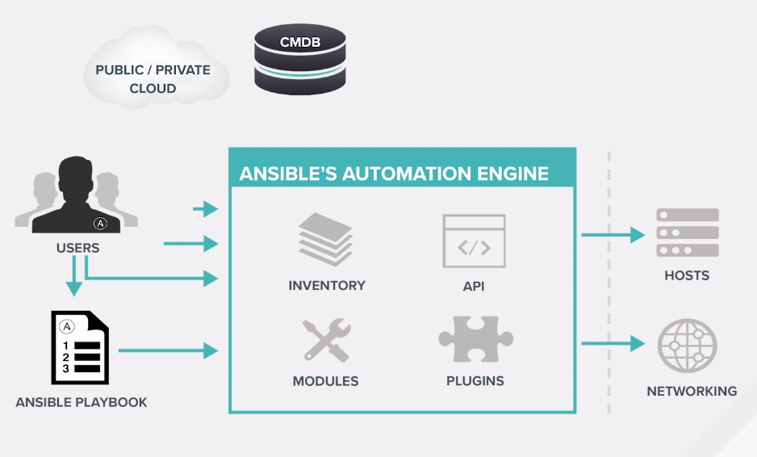

# What is Ansible?
  - It's a simple automation language that can perfectly describe an IT application infrastructure in Ansible playbooks.
  - It's an automation engine that runs Ansible playbooks
  - Ansible Tower by Red Hat is an enterprise framework for controlling, sercuring, and managing your Ansible automation with a UI and restful API

## Configuration Management Systems
💡  Wikipedia defines Configuration management (CM) as  a systems engineering process for establishing and maintaining consistency of a product's performance, functional, and physical attributes with its requirements, design, and operational information throughout its life.

### Configuration Management (CM) is the automated control of:
  - Deployed artifacts
  - Configuration files
  - System packages
  - User configurations
  - Services
  - Dependencies

### Why do we need Configuration Managements Systems?
  - Cost avoidance
  - Prevention of catastrophic events
  - Exponential increase of time saving in the form of reusable code

Good CM tool allows code reuse and templating among servers that share the same configuration. For example, a database configuration should be deployable on any server the code was designed for. A database template might provide instructions for:
  - provisioning the server using a cloud provider of choice
  - installing the database
  - configuring it with details like usernames, passwords
  - the proper permissions for the accessibility to other infrastructure components like web servers.

## About Ansible
System admins and DevOps engineers are often responsible for managing tens or thousands of computers. Some application upgrade requires complex task orchestrations. Automation tools like <b>Ansible</b> make this daunting workload practical. Ansible has become a favorite tool for DevOps engineers looking to automate many of their previously manual or simply scripted processes with its ability to very quickly turn those processes into idempotent automation tasks.
```bash
Ansible is an open-source IT automation tool. It can configure systems, deploy software, and orchestrate more advanced IT tasks such as continuous deployments.
```
## <center>The Ansible Structure</center>




Ansible’s main goals are <b>simplicity</b> and <b>ease-of-use</b>. It also has a strong focus on security and reliability, featuring a minimum of moving parts, usage of OpenSSH for transport (with other transports and pull modes as alternatives), and a language that is designed around auditability by humans.

## Installation
Ansible is an agentless automation tool that by default manages machines over the SSH protocol. Once installed, Ansible does not add a database, and there will be no daemons to start or keep running. You only need to install it on one machine (which could easily be a laptop) and it can manage an entire fleet of remote machines from that central point. When Ansible manages remote machines, it does not leave software installed or running on them, so there’s no real question about how to upgrade Ansible when moving to a new version.

### Installing Ansible with yum or apt-get
We can install Ansible using yum and apt package managers.

```bash
#For install with yum:
sudo yum -y install ansible

#For install with apt:
sudo apt-get -y install ansible
```
### Installing Ansible with pip
The other way to install Ansible is with the pip, the Python package manager. If pip isn’t already available on your system of Python, run the following commands to install it:
```bash
curl https://bootstrap.pypa.io/get-pip.py -o get-pip.py
python get-pip.py --user
#Then install Ansible:
pip install --user ansible
#After the installation check is installation done
ansible --version
```

If you install with pip config file will be none, otherwise you can see config file location.

We will not dive into installation issues. We recommend you to install Ansible with `apt` or `yum` package managers. But if you still want to learn more about installation issues check the documentation page!

Resource:
https://docs.ansible.com/ansible/latest/installation_guide/intro_installation.html


### Configuring Ansible
Ansible supports several sources for configuring its behavior, including an ini file named ansible.cfg, environment variables, command-line options, playbook keywords, and variables.

Certain settings in Ansible are adjustable via a configuration file (ansible.cfg). The stock configuration should be sufficient for most users, but there may be reasons you would want to change them. Paths where configuration file is searched are listed in reference documentation.

### Getting the latest configuration file
If installing Ansible from a package manager, the latest ansible.cfg file should be present in `/etc/ansible`

If you installed Ansible from pip or from source, you may want to create this file in order to override default settings in Ansible.

An example file is available on GitHub.

Changes can be made and used in a configuration file which will be searched for in the following order:
  - ANSIBLE_CONFIG (environment variable if set)
  - ansible.cfg (in the current directory)
  - ~/.ansible.cfg (in the home directory)
  - /etc/ansible/ansible.cfg
```bash
Ansible will process the above list and use the first file found, all others are ignored.
```

# Ansible Concepts
These concepts are common to all uses of Ansible. You need to understand them to use Ansible for any kind of automation:

### Control node
Any machine with Ansible installed. You can run commands and playbooks, invoking /usr/bin/ansible or /usr/bin/ansible-playbook, from any control node. You can use any computer that has Python installed on it as a control node - laptops, shared desktops, and servers can all run Ansible. However, you cannot use a Windows machine as a control node. You can have multiple control nodes.

### Managed Nodes
The network devices (and/or servers) you manage with Ansible. Managed nodes are also sometimes called hosts. Ansible is not installed on managed nodes.

### Inventory
A list of managed nodes. An inventory file is also sometimes called a hostfile. Your inventory can specify information like IP address for each managed node. An inventory can also organize managed nodes, creating and nesting groups for easier scaling.

### Modules
The units of code Ansible executes. Each module has a particular use, from administering users on a specific type of database to managing VLAN interfaces on a specific type of network device. You can invoke a single module with a task, or invoke several different modules in a playbook.

### Tasks
The units of action in Ansible. You can execute a single task once with an ad-hoc command.

### Playbooks
Ordered lists of tasks, saved so you can run those tasks in that order repeatedly. Playbooks can include variables as well as tasks. Playbooks are written in YAML and are easy to read, write, share and understand.